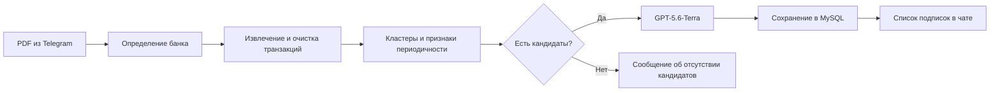

# Subscription Scanner

Telegram-бот и прототип Telegram Mini App для поиска регулярных платных подписок по банковским выпискам.

Проект помогает выделить повторяющиеся списания, посмотреть историю платежей и оценить будущие расходы. Анализ использует алгоритмическую группировку транзакций и модель **GPT-5.6-Terra**. В текущем demo запросы к модели проходят через HydraAI.

> **Статус:** две отдельные версии проекта. В `sber_bot-demo` реализован сценарий анализа PDF через чат. В `sber_bot-step-3-miniapp` подготовлены бот, HTTP-сервер и интерфейс Mini App; серверная загрузка файлов и анализ ещё не подключены. Объединённая архитектура описана отдельно и пока не реализована.

## Возможности

| Возможность | Demo-бот | Mini App |
|---|---|---|
| Команда `/start` | Реализована | Реализована |
| Открытие Mini App | Кнопка с фиксированным URL-заглушкой | Кнопка с URL из настроек |
| Приём PDF | Через сообщения Telegram | Не реализован |
| Парсинг PDF Сбера и Т-Банка | Реализован | Не подключён |
| Поиск кандидатов на подписки | Реализован | Не подключён |
| Классификация GPT-5.6-Terra | Реализована через HydraAI | Не подключена |
| Сохранение результатов в MySQL | Реализовано | Не подключено |
| Просмотр деталей подписки | Через inline-кнопки | Не реализован |
| Программный расчёт статистики | Функции есть, но не подключены к выдаче | Не подключён |
| Проверка состояния HTTP-сервера | Нет | `GET /health` |

В интерфейсе Mini App сейчас указаны CSV/XLSX, а выбор файла допускает также XLS. Это заготовка интерфейса: серверных обработчиков этих форматов нет. Реализованные парсеры находятся в demo и работают с PDF.

## Как устроен анализ в demo



Сначала алгоритм отбирает расходные операции, исключает некоторые категории, группирует похожие названия и суммы, рассчитывает признаки регулярности. Затем модель классифицирует подготовленные кандидаты. Если кандидатов нет, запрос к модели не выполняется и запись о выписке в текущем сценарии не сохраняется.

При выборе подписки demo загружает сохранённую выписку и отправляет её транзакции модели для подробного ответа. Предлагаемая следующая версия будет использовать сохранённые связи подписки с операциями и рассчитывать денежные итоги программно.

## Структура исходников

Архивы распаковываются в два самостоятельных каталога. Запускать каждую версию нужно из её корня.

```text
sber_bot-demo/
├── main.py                  # обработчики Telegram и основной сценарий
├── bot.py                   # экземпляр Telegram-бота
├── config.py                # загрузка токенов из окружения
├── utils.py                 # PDF-парсеры и клавиатура
├── subscription_finder.py   # кластеры и признаки регулярности
├── chart_generator.py       # расчёты и текстовая карточка статистики
├── database.py              # MySQL, сохранение и чтение выписок
├── llm_helpers.py           # повтор запросов и обработка ошибок модели
├── integrations/
│   ├── hydraai.py            # клиент сервиса подключения к модели
│   └── schemas.py            # структура ответа клиента
├── prompt.txt               # шаблон классификации
├── prompt_subscription.txt  # шаблон подробного анализа
├── start_message.txt
└── requirements.txt

sber_bot-step-3-miniapp/
├── main.py                  # запуск бота
├── bot/
│   ├── main.py               # polling
│   ├── handlers.py           # /start и открытие приложения
│   └── keyboards.py
├── api/app.py                # FastAPI: /health и статические файлы
├── core/config.py            # BOT_TOKEN и WEBAPP_URL
├── webapp/
│   ├── index.html            # интерфейс выбора файла
│   └── telegram-web-app.js
├── models/                  # заготовка
├── tests/                   # заготовка
├── data/
├── uploads/
├── .env.example
└── requirements.txt
```

## Подготовка

Для запуска понадобятся Python с модулем `venv`, доступ к Telegram и токен бота. Для demo также необходимы MySQL и доступ к модели через сервис, используемый в `integrations/hydraai.py`.

Команды ниже рассчитаны на PowerShell в Windows. Для каждой версии создайте отдельное виртуальное окружение. Не используйте окружение Python, вложенное в исходный архив: установите зависимости заново.

Из корня выбранной версии:

```powershell
py -m venv .venv
.\.venv\Scripts\python.exe -m pip install -r requirements.txt
```

Установка зависимостей и запуск внешних сервисов при подготовке этого README не проверялись. Версии пакетов берутся из соответствующего `requirements.txt`; совместимость списков двух проектов необходимо проверять отдельно.

## Запуск Mini App

### 1. Настройки

В каталоге `sber_bot-step-3-miniapp` создайте `.env` из примера:

```powershell
Copy-Item .env.example .env
```

Заполните действующие настройки:

```dotenv
BOT_TOKEN=your_telegram_bot_token
WEBAPP_URL=
```

Для просмотра страницы локально `WEBAPP_URL` можно оставить пустым. Для открытия через Telegram укажите публичный HTTPS-адрес сервера Mini App.

**Сейчас `core/config.py` читает только `BOT_TOKEN` и `WEBAPP_URL`.** Остальные переменные в `.env.example` — `DATABASE_URL`, `UPLOAD_DIR`, `MAX_UPLOAD_MB`, настройки LLM и Ollama — являются заготовками и не включают эти возможности. Указанная там другая модель также не используется приложением.

### 2. HTTP-сервер

В первом терминале, из корня Mini App:

```powershell
.\.venv\Scripts\python.exe -m uvicorn api.app:app --host 127.0.0.1 --port 8000 --reload
```

Откройте [локальную страницу](http://127.0.0.1:8000/) или [проверку состояния](http://127.0.0.1:8000/health).

Ожидаемый ответ `/health`:

```json
{"status":"ok","service":"subscription-scanner"}
```

### 3. Telegram-бот

Во втором терминале, из того же каталога:

```powershell
.\.venv\Scripts\python.exe main.py
```

Отправьте боту `/start`. При заполненном `WEBAPP_URL` кнопка «Найти подписки» открывает приложение. Локальный адрес `127.0.0.1` не является публичным адресом для телефона; HTTPS-доступ настраивается отдельно.

На текущем этапе кнопка «Проанализировать» только показывает имя выбранного файла. Файл не отправляется на сервер, отчёт не формируется.

## Запуск demo-бота

### 1. Настройки

В каталоге `sber_bot-demo` создайте локальный `.env`:

```dotenv
BOT_TOKEN=your_telegram_bot_token
HYDRAI_TOKEN=your_provider_token

DB_HOST=localhost
DB_PORT=3306
DB_USER=subscriptions_app
DB_PASSWORD=your_database_password
DB_NAME=subscriptions_bot
```

Имя `HYDRAI_TOKEN` приведено точно как в исходном коде. Модель `gpt-5.6-terra` указана непосредственно в вызовах из `main.py`; переменной для её выбора в текущей конфигурации нет.

### 2. MySQL

MySQL должен быть запущен и доступен с указанными параметрами. Текущий `database.py` при старте выполняет создание базы и таблицы `statements`, а также добавляет недостающие столбцы. Учётной записи нужны права на эти операции. Имя базы задавайте простым идентификатором из букв, цифр и подчёркиваний.

В планируемой архитектуре создание схемы будет вынесено в отдельные миграции.

### 3. Бот

Из корня demo:

```powershell
.\.venv\Scripts\python.exe main.py
```

Отправьте `/start`, затем PDF-выписку Сбера или Т-Банка. После анализа бот должен показать найденные подписки; inline-кнопка открывает подробный ответ по выбранной подписке.

Запуск из корня важен: тексты сообщений и шаблоны читаются по относительным путям.

Не запускайте две версии polling-бота одновременно с одним токеном. Для параллельного просмотра используйте разные токены либо остановите одну версию.

## Форматы и качество результата

- Парсеры рассчитаны на определённое расположение текста в PDF Сбера и Т-Банка. Другие макеты могут потребовать доработки.
- OCR для сканированных изображений страниц не реализован.
- Регулярное списание — признак возможной подписки; оно не подтверждает, что подписка активна сегодня.
- Повторяющиеся платежи могут группироваться ошибочно. Порог суммы и список исключений могут пропускать некоторые подписки.
- Прогноз расходов следует отделять от фактически потраченной суммы. В текущем demo функции статистики существуют отдельно и не вызываются обработчиком подробного ответа.

## Данные и ограничения текущего demo

В MySQL сохраняются ID пользователя и чата, транзакции, названия подписок и кластеры. При подробном анализе транзакции всей выписки передаются внешнему сервису модели. Кластеры и ответы также записываются в `logs/pdf_extract.log`.

Перед использованием с реальными пользовательскими выписками необходимо:

- добавить проверку владельца при чтении выписки из callback;
- убрать содержимое транзакций и ответов из журналов;
- ограничить размер файла и объём обработки;
- проверять структуру ответа модели и принадлежность возвращённых кластеров;
- добавить удаление данных и сроки хранения;
- реализовать серверную проверку Telegram-данных для API Mini App.

Токены, `.env`, журналы и пользовательские выписки не должны попадать в репозиторий или публичный архив. Используйте синтетические либо обезличенные примеры для разработки.

## План развития

1. Вынести парсеры, поиск подписок и статистику в общее ядро.
2. Добавить модели данных, миграции и фоновые задания.
3. Реализовать API загрузки PDF, статусов и отчётов с проверкой пользователя.
4. Подключить Mini App к API и отобразить результаты анализа.
5. Считать денежные итоги программно по связанным транзакциям.
6. Перевести demo-бота на общий сценарий обработки.
7. Добавить CSV/XLSX после определения поддерживаемых шаблонов.

## Проверка после запуска

Для Mini App проверьте `/health`, открытие страницы, `/start` и реакцию интерфейса на выбор файла. Это проверяет каркас, но не анализ выписки.

Для demo используйте обезличенные PDF обоих банков. Проверьте извлечение дат и знаков сумм, результат без кандидатов, обработку ошибки модели и просмотр деталей. Наличие обработчиков в коде само по себе не подтверждает успешный запуск с текущими внешними сервисами.

В каталоге `tests` Mini App пока нет содержательных тестов. В плане проверки объединённой версии: корректность парсинга и денежных расчётов, доступ только к своим выпискам, неверный ответ LLM, повтор задания и удаление во время обработки.

## Документация и схемы

- [Подробная архитектура](ARCHITECTURE.md)
- [Общая схема компонентов](architecture-diagram.png)
- [Путь пользователя](user-journey.png)
- [Структура базы данных](database-structure.png)
- [Этапы анализа](analysis-pipeline.png)

Эти дополнительные схемы описывают предлагаемую объединённую версию. Храните файлы рядом с README, чтобы ссылки работали после переноса.
