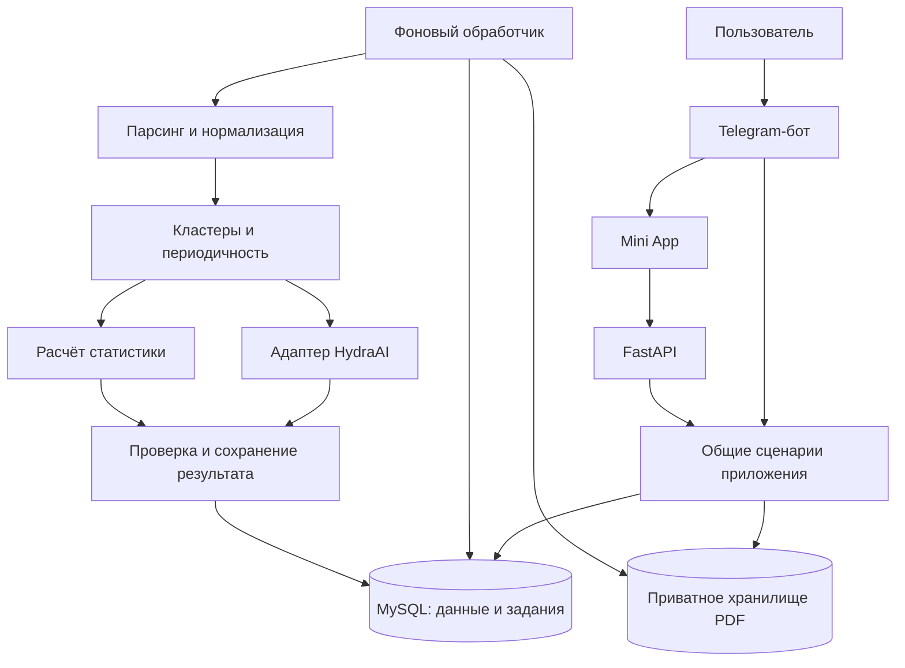

# Архитектура Subscription Scanner

Проект: поиск регулярных платных подписок по банковским выпискам через Telegram-бота и Telegram Mini App.

## 1. Что есть в архивах

| Область | sber_bot-demo | sber_bot-step-3-miniapp |
|---|---|---|
| Telegram | Приём PDF, выдача списка подписок, просмотр деталей | Приветствие и кнопка открытия Mini App |
| Интерфейс | Сообщения и inline-кнопки | HTML/CSS/JS, выбор файла без отправки на сервер |
| HTTP API | Нет | FastAPI: `/health` и раздача статики |
| Парсинг | PDF Сбера и Т-Банка через pdfplumber | Не реализован |
| Поиск подписок | Кластеризация, признаки периодичности, классификация через HydraAI | Не реализован |
| Хранение | MySQL, таблица statements с JSON в текстовых полях | Модели отсутствуют; SQLAlchemy только указан в зависимостях |
| Статистика | Функции расчёта есть, но в обработчике деталей не вызываются | Не реализована |

В Mini App заявлены CSV/XLSX, а поле выбора также допускает XLS. Ни один из этих форматов пока не обрабатывается сервером. Для первого объединённого выпуска предлагается PDF; CSV/XLSX добавляются после определения поддерживаемых шаблонов. XLS не заявлять до появления отдельного парсера.

## 2. Основное решение

Один репозиторий и общий Python-модуль бизнес-логики. Три запускаемых процесса: бот, API и обработчик фоновых заданий. Они используют одну MySQL и одно приватное хранилище файлов.

Каркас берём из Mini App, алгоритмы — из demo. Бот и HTTP API принимают запросы и показывают результат; парсинг, поиск подписок и расчёты выполняются общими сервисами. Отдельные микросервисы для каждого алгоритма на этой стадии не нужны.



Стрелки показывают обращения между компонентами. API читает сохранённый результат из БД через общие сценарии; Mini App опрашивает статус задания.

## 3. Предлагаемая структура папок

```text
subscription-scanner/
├── app/
│   ├── core/
│   │   ├── config.py              # единая конфигурация
│   │   └── logging.py             # журналы без содержимого выписок
│   ├── domain/
│   │   ├── entities.py            # выписка, транзакция, кандидат, подписка
│   │   ├── normalization.py       # даты, суммы, названия
│   │   ├── clustering.py          # группировка списаний
│   │   ├── periodicity.py         # период и признаки регулярности
│   │   └── statistics.py          # суммы и прогнозы
│   ├── application/
│   │   ├── ports.py               # контракты хранилища, парсеров, LLM
│   │   ├── submit_statement.py    # принять файл и создать задание
│   │   ├── analyze_statement.py   # выполнить этапы анализа
│   │   ├── get_report.py          # получить результат своего пользователя
│   │   └── delete_statement.py    # удалить данные и отменить обработку
│   ├── infrastructure/
│   │   ├── parsers/
│   │   │   ├── registry.py        # выбор формата и банка
│   │   │   ├── sber_pdf.py
│   │   │   └── tbank_pdf.py
│   │   ├── llm/
│   │   │   ├── hydra.py           # HTTP, таймауты, повторы
│   │   │   ├── schemas.py         # проверка ответа модели
│   │   │   └── prompts/           # версионируемые шаблоны
│   │   ├── db/
│   │   │   ├── models.py
│   │   │   ├── session.py
│   │   │   └── repositories.py
│   │   ├── storage.py            # приватные файлы и очистка
│   │   └── jobs.py               # получение и фиксация заданий
│   ├── api/
│   │   ├── main.py
│   │   ├── auth.py               # проверка Telegram initData
│   │   ├── schemas.py            # входные и выходные модели API
│   │   └── routes/
│   │       ├── session.py
│   │       ├── statements.py
│   │       └── subscriptions.py
│   ├── bot/
│   │   ├── main.py
│   │   ├── handlers.py
│   │   ├── keyboards.py
│   │   └── presenters.py         # форматирование сообщений
│   └── worker/
│       └── main.py
├── webapp/
│   ├── index.html
│   ├── styles.css
│   └── js/
│       ├── telegram.js
│       ├── api.js
│       ├── upload.js
│       └── report.js
├── migrations/
├── tests/
│   ├── unit/
│   ├── integration/
│   └── fixtures/                  # синтетические/обезличенные выписки
├── deploy/
│   ├── Dockerfile
│   └── compose.yaml
├── pyproject.toml
├── .env.example
├── .gitignore
└── README.md
```

Это целевая структура: перечисленные новые модули ещё предстоит реализовать. `domain` не импортирует Telegram, FastAPI, SQLAlchemy или HydraAI. `application` использует доменные функции и контракты; инфраструктура реализует эти контракты. Сборка зависимостей происходит в точках запуска.

## 4. Сценарий обработки

1. Пользователь открывает Mini App и проходит серверную проверку Telegram-данных.
2. API проверяет размер и формат файла, сохраняет его под случайным внутренним именем. Предлагаемые стартовые пределы: 10 МБ, 100 страниц, 20 000 операций; значения вынести в конфигурацию и уточнить по реальным образцам.
3. В одной транзакции БД создаются выписка и задание. API возвращает `202 Accepted` с идентификатором выписки.
4. Worker получает задание, определяет банк, извлекает операции, нормализует даты, суммы и валюту. Ошибки строк учитываются явно, без молчаливой потери операций.
5. Алгоритм выделяет кандидатов и рассчитывает признаки регулярности. Отсутствие кандидатов — успешный пустой результат.
6. Если классификация моделью включена, ей передаются только необходимые обезличенные данные кандидатов. Ответ проверяется по схеме и по принадлежности идентификаторов исходным кластерам.
7. Статистика считается программно по связанным транзакциям. Результат и статус сохраняются атомарно.
8. Mini App получает отчёт: список, история списаний, оценка периодичности и прогноз. При загрузке через чат бот использует тот же сценарий и читает тот же результат.

Статусы задания: `queued → processing → completed`; при временной ошибке — повтор через `queued`, при исчерпании попыток — `failed`. Этап обработки хранится отдельно: `parsing`, `detecting`, `classifying`, `saving`. Ограничение на три попытки — предлагаемый стартовый параметр.

В MVP очередь можно хранить в MySQL: атомарное получение задания, `locked_until`, счётчик попыток и восстановление после падения worker. Один активный анализ на выписку; повторная обработка не создаёт дубликаты результата. Повторная загрузка определяется по владельцу, хешу файла и версии анализатора. При удалении ставится признак отмены; worker перед записью проверяет, что выписка ещё существует и не удаляется.

## 5. Данные

| Таблица | Назначение и ключевые поля |
|---|---|
| users | id, telegram_user_id UNIQUE, created_at |
| statements | id, user_id FK, source, bank, file_hash, storage_key, status, parser_version, period_from, period_to, expires_at |
| analysis_jobs | id, statement_id FK, status, stage, attempts, locked_until, next_attempt_at, error_code, analyzer_version |
| transactions | id, statement_id FK, source_row, operation_date, amount DECIMAL, currency, description, merchant_normalized |
| subscriptions | id, statement_id FK, name, period_type, classification_status, confidence, evidence, monthly_estimate, yearly_estimate, currency |
| subscription_transactions | subscription_id FK, transaction_id FK; составной уникальный ключ |

Индексы: выписки по владельцу и дате, операции по выписке и дате, задания по статусу и времени следующего запуска. Связи подписок и операций должны принадлежать одной выписке; это проверяется при сохранении. Удаление выписки удаляет зависимые записи и файл. Исторические результаты относятся к конкретной выписке и не суммируются между пересекающимися выписками автоматически.

Деньги: `Decimal` в Python и `DECIMAL` в БД, в JSON — строки, например `"299.00"`. Даты — ISO 8601. Расходы внутри системы отрицательные, в отображении стоимости подписки — положительные. Разные валюты не суммируются без отдельного правила конвертации.

Фактические расходы за период — сумма найденных списаний. Прогноз — отдельная величина: средний платёж × число платежей за год (52/12/4/1 для недельного/месячного/квартального/годового периода), месячный эквивалент = годовой / 12. При неизвестном периоде прогноз отсутствует. Потенциальная экономия рассчитывается только для выбранных пользователем подписок и помечается как оценка. Наличие списаний само по себе не подтверждает, что подписка активна сейчас.

## 6. API

Все пользовательские маршруты, кроме создания сессии, требуют серверной сессии и проверки владельца объекта.

| Метод | Маршрут | Результат |
|---|---|---|
| POST | /api/v1/session | Проверить initData, создать короткоживущую сессию |
| POST | /api/v1/statements | Принять multipart PDF, вернуть 202 и statement_id |
| GET | /api/v1/statements | Список выписок текущего пользователя с пагинацией |
| GET | /api/v1/statements/{id} | Статус, этап, безопасное описание ошибки |
| GET | /api/v1/statements/{id}/report | Сводка и подписки; до готовности 409 с кодом report_not_ready |
| GET | /api/v1/subscriptions/{id} | Подписка и связанные списания |
| DELETE | /api/v1/statements/{id} | Запустить отмену и удаление, вернуть 202; чтение сразу запрещено |
| GET | /health | Состояние процесса без чувствительных данных |

Общий формат ошибки: `{"error":{"code":"unsupported_format","message":"Этот формат пока не поддерживается"}}`. Для чужого или отсутствующего объекта — одинаковый ответ 404. Маршруты `/api/v1` регистрируются до монтирования статики на `/`, иначе обработчик статики может перехватить запросы.

В Mini App `initDataUnsafe` допустимо использовать для приветствия, но серверу необходимо проверять подпись исходного `initData` и время `auth_date`. Это требование Telegram: [официальная документация проверки данных Mini App](https://core.telegram.org/bots/webapps#validating-data-received-via-the-mini-app). Для авторизованного приложения выбрать inline-кнопку или кнопку меню и проверить выбранный способ запуска на настоящем клиенте Telegram; текущую reply-клавиатуру не считать готовой схемой входа. Предлагаемый срок приёма initData — 5 минут, срок собственной сессии — 30 минут; это настройки проекта, не значения из протокола Telegram. Пустые данные в обычном браузере не дают доступ к реальным выпискам.

## 7. Что переносить и что исправить

| Исходный код | Перенос и необходимые изменения |
|---|---|
| demo/utils.py | Разделить PDF-парсеры и клавиатуры; убрать фиксированный WEBAPP_URL |
| demo/main.py: clean_record | Перенести в normalization; заменить float, валидировать дату и валюту |
| demo/subscription_finder.py | Разделить кластеризацию и периодичность; устранить двойное определение `_parse_date`; пороги вынести в настройки |
| demo/chart_generator.py | Перенести расчёты в domain/statistics, оформление — в presenters; включить расчёты в отчёт |
| demo/integrations/hydraai.py и llm_helpers.py | Единый адаптер с ограниченными таймаутами, повтором временных ошибок и проверкой `success` и схемы |
| demo/database.py | Репозитории, модели и миграции; существующие JSON-записи преобразовывать отдельной проверяемой миграцией |
| miniapp/api/app.py | Добавить авторизацию, загрузку, статусы и отчёты |
| miniapp/webapp/index.html | Реальная отправка PDF, отображение обработки, результата и ошибок |
| miniapp/core/config.py | Общие настройки БД, файлов, LLM и лимитов; строгая проверка WEBAPP_URL |

Обнаруженные ограничения, которые влияют на архитектуру:

- В callback demo выписка читается только по ID; сравнения владельца с `callback_query.from_user.id` нет. Проверку владельца необходимо выполнять в общем сценарии чтения, включая обращения из бота.
- В demo парсинг PDF выполняется прямо в асинхронном обработчике. Выделенный worker отделяет длительную работу от ответов API и бота.
- В demo полный набор транзакций отправляется модели при просмотре подписки, а кластеры и ответы записываются в журнал. Целевая версия использует сохранённые связи с операциями и журналы с идентификаторами, длительностью и кодами ошибок.
- Ответ LLM после `json.loads` читается без полноценной проверки структуры. Модель не должна добавлять транзакции или определять денежные итоги.
- Расчёт кластеров попарный, O(n²); до увеличения лимита операций нужны замеры и предварительная группировка кандидатов.
- В demo дата разбирается двумя функциями с одним именем; итоговая версия может выбрасывать исключения для некорректной даты. Нормализация должна завершаться до кластеризации.

При недоступности LLM сохранять кандидатов с пометкой «требует проверки», а не выдавать их за подтверждённые подписки. Повтор классификации не должен заново парсить PDF.

## 8. Развёртывание и эксплуатация

Предлагаемый первый контур: один сервер, HTTPS-прокси, процессы `api`, `bot`, `worker`, MySQL и приватный файловый том. Статическая Mini App обслуживается с того же домена, что и API. Миграции выполняются отдельным шагом перед запуском; рабочая учётная запись приложения не создаёт базу при старте.

Redis и отдельное объектное хранилище добавляются при необходимости нескольких серверов или роста очереди. До этого достаточно очереди в MySQL и общего тома. Версии зависимостей фиксируются после проверки совместимости; списки из двух архивов не объединяются вслепую.

Предлагаемая политика хранения: исходный PDF удалять после успешного парсинга, при ошибке — не позднее 24 часов; операции и отчёты — через 30 дней либо по запросу пользователя. Сроки являются проектным предложением и должны быть отражены в интерфейсе. Очистка файлов и БД выполняется по расписанию; резервные копии имеют отдельный ограниченный срок хранения. Файлы не раздаются через `/uploads`.

Секреты задаются через окружение; в исходники и поставку входят только примеры без значений. В большом архиве есть `.env`, журналы и окружение Python; они не нужны в исходной поставке. Содержимое `.env` при анализе не выводилось и в результат не включено.

## 9. Порядок реализации и критерии готовности

1. **Общее ядро.** Извлечь парсеры, нормализацию и алгоритмы. Проверить синтетические PDF обоих банков, знаки сумм, неверные даты и отсутствие кандидатов.
2. **Хранение и задания.** Добавить модели, миграции и worker. Проверить повторную загрузку, падение worker, повтор выполнения и удаление во время обработки.
3. **API и вход.** Реализовать проверку Telegram, лимиты загрузки и доступ по владельцу. Проверить поддельные/просроченные initData и попытку прочитать чужую выписку.
4. **Mini App.** Подключить PDF-загрузку, статус, список подписок, детали и удаление. Проверить полный путь в Telegram на мобильном клиенте.
5. **LLM и отчёт.** Подключить адаптер, схемы, привязку к транзакциям и программные суммы. Проверить таймаут, неверный JSON, неизвестный cluster_id, отсутствие дублирования и точность денежных расчётов.
6. **Перенос demo-бота.** Переключить обработчики на общий сценарий. Одинаковый файл через бот и Mini App должен давать одинаковые числовые результаты при одинаковой версии анализа.
7. **Расширение форматов.** Добавить CSV/XLSX только с явными шаблонами колонок, обезличенными примерами и тестами.

Первый завершённый выпуск: пользователь открывает приложение, отправляет PDF Сбера или Т-Банка, видит ход анализа, получает отчёт и может удалить свои данные. Ни авторизация, ни загрузка, ни результаты не должны оставаться заглушками.
